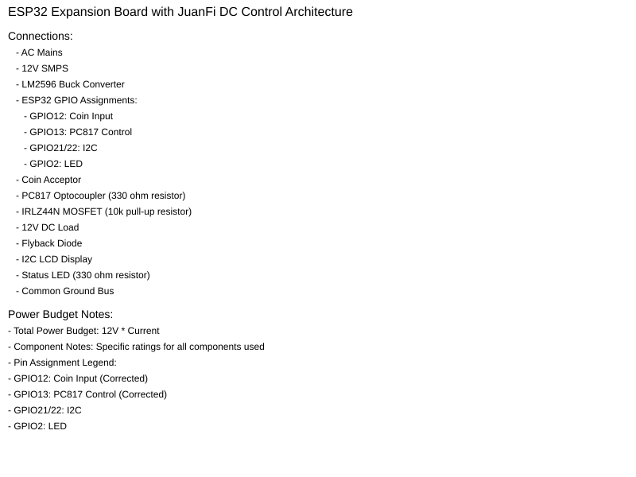

# ESP32 Expansion Board – Vendo Machine

## System Architecture

## GPIO Mapping

| Function       | GPIO   |
|----------------|--------|
| Coin input     | GPIO27 |
| Output control | GPIO23 |
| I2C SDA        | GPIO21 |
| I2C SCL        | GPIO22 |
| System LED     | GPIO2  |
